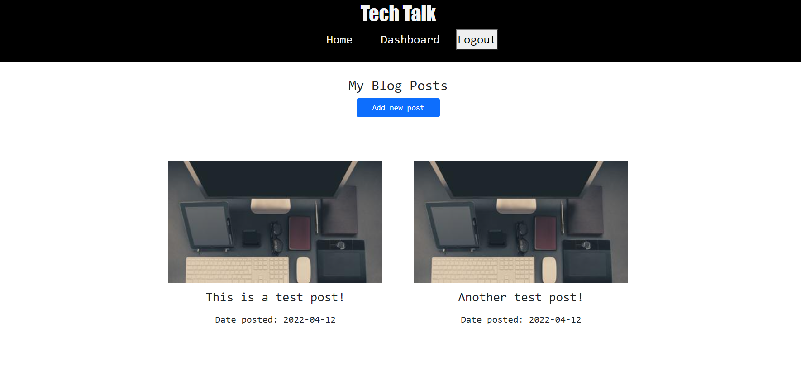

# Tech Talk: A CMS-style blog site
 

## Description

- A CMS-style blog site similar to a Wordpress site, where users can publish their blog posts and view/comment on other developers’ posts as well.
- Built using the following technologies:
    - Node.js
    - Express.js
    - [MySQL2](https://www.npmjs.com/package/mysql)
    - [Sequelize](https://www.npmjs.com/package/sequelize)
    - [dotenv](https://www.npmjs.com/package/dotenv)
    - [express-handlebars](https://www.npmjs.com/package/express-handlebars)
    - [bcrypt package](https://www.npmjs.com/package/bcrypt)
    - [express-session](https://www.npmjs.com/package/express-session)
    - [connect-session-sequelize](https://www.npmjs.com/package/connect-session-sequelize) 

 

## Installation

* No installation required  - open the app via Heroku.

 

## Usage
 

App Features:

* Login to view the dashboard where you can create/update/delete blog posts.
* View all posts from each user/author.
* Comment on other users' blog posts.

 

    <i>Create/Update/Delete post in dashboard</i>

 

    

    

 

    <i>View a single blog post and view/leave comments</i>

 

    

 

## License
This code is licensed under [MIT License](https://mit-license.org/).

 

## Tests
This application has no tests as of the moment.
 

## Questions
If you have any questions, please don't hesitate to contact:
 * Github - [github.com/nvsco-10](https://github.com/nvsco-10)
 * Email - neemavelasco@gmail.com

